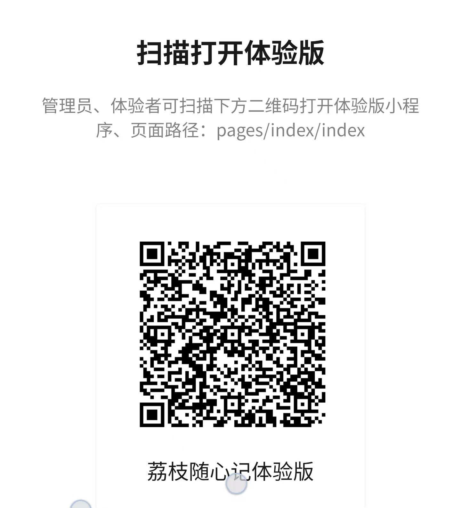

# 生活小助手小程序 · 源码仓库（LIZHI_WECHACT）

> 一款面向个人与家庭的轻量化生活管理微信小程序——以**可自定义的首页仪表盘**为核心，一站式覆盖待办打卡、记账理财、菜谱食材、物资进度、快递取件、家庭用药与健康档案等日常场景。

本仓库为「生活小助手」微信小程序的 **源码 + 配套文档** 集合。

## 📂 目录导航

| 路径 | 内容 |
|------|------|
| [`小程序源码/`](./小程序源码/) | 微信开发者工具每次迭代用的小程序源码（`app.*` / `pages` / 组件 / 云函数 / 配置），干净可编译。 |
| [`说明文档/`](./说明文档/) | 非功能性文档：功能简介大纲（产品亮点 · 四级功能结构 · 技术栈 · 迭代记录）、使用说明书（docx）、功能清单（docx）、文档生成脚本、自动化测试脚本、开发部署指南、体验二维码。 |

## ✨ 核心亮点

- **可自定义首页仪表盘**：拖拽排序、重命名、隐藏/删除板块，并支持新建 5 类自定义模块（待办 / 打卡 / 任务 / 数值记录 / 生活记录）。
- **多场景一站式管理**：记账、菜谱、物资剩余、取件、用药集中在一个小程序内，免去多 App 切换。
- **本地账号 + 微信一键登录**：支持账号密码注册登录与微信免密登录，游客缓存数据可合并进正式账号。
- **主题与字体个性化**：全局色调色板 + 字体大小/粗细调节，所有页面实时生效。

## 🚀 快速体验

微信扫描下方二维码，即可打开「荔枝随心记」体验版小程序：

> 功能详解见 [`说明文档/README.md`](./说明文档/README.md)，开发部署与配置见 [`说明文档/文档/`](./说明文档/文档/)。

---

© 生活小助手 · 微信小程序
